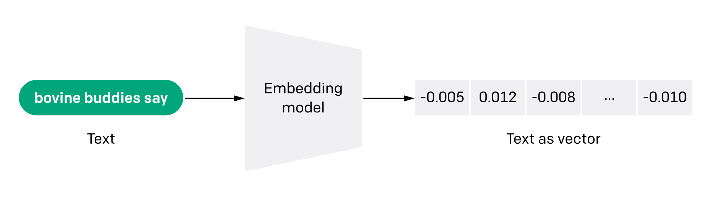

<!-- .slide:-->

# Embedding

## Principe

* Conversion de texte en vecteurs numériques denses
  
* Capture le sens et les relations entre les mots et phrases
  
* Permet la comparaison de textes et la recherche de similarités
 

Notes:

- permet de représenter le texte de manière compréhensible pour les machines
- représentation cruciale pour la recherche et la comparaison de textes

##==##

<!-- .slide:-->

# Embedding

## Recherche de similarités

<iframe src="https://openai.com/index/introducing-text-and-code-embeddings/#text-similarity-models" title="embeddings visualisation" frameborder="0"
style="width: 100%; height: 100%;"></iframe>

Notes:
- k-Nearest Neighbors (k-Plus Proches Voisins)
- permet de récupérer les documents ayant des vecteurs similaires
    - ayant une similarité dans le contenu
    - ne pas prendre en compte ce qui diffère trop

##==##

<!-- .slide:-->

# LangChain

## Vector stores

 

* Stockage de données d'enrichissement

    
    
    
    

* [Vector Stores compatibles](https://python.langchain.com/docs/integrations/vectorstores/)
  

* Attention à l'aspect bêta des interfaces

Notes:
exception bêta ChatMessageHistory
car essentiellement encore codé sur le moèdle Chain et non LCEL (donc non chainable pour le moment)

- "classiques" : pgvector (PostGres), Pinecone
- FAISS : moteur vectoriel de Meta
- BDD graph ayant une compatibilité vectorielle : Neo4J

##==##

<!-- .slide:-->

# LangChain

## Retrievers

- Coeur principal des RAG (Retrieval Augmented Generation)
- Interprétation des données

<a href="https://python.langchain.com/docs/modules/data_connection/" style="font-size: 20px;display: block">LangChain - Retrieval</a>

<!-- .element: class="credits" -->

##==##

<!-- .slide:  class="exercice"-->

# 04 - LangChain

## Lab

* Stockage de données
