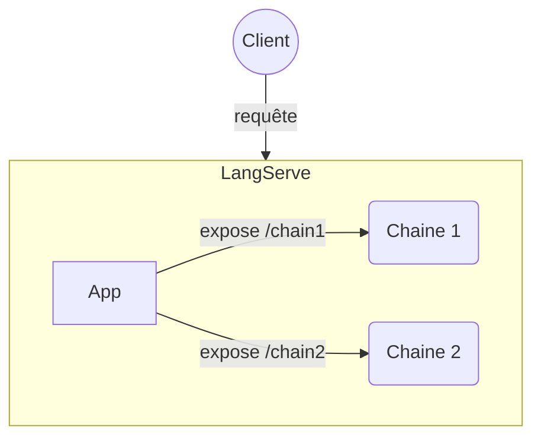

# LangChain - LangServe

## Objectifs

* Construire deux ChatBots (Mistral, CodeLLama)
* Construire la partie Backend d'exposition
* Définir un client de test de notre exposition

## Etapes

### Deux chatbot

Construire à partir des labs précédents deux chats bots (ex: Mistral & LLama2).

### LangServe

Définir un fichier python `server.py`, qui va permettre d'exécuter LangServe.
Y créer deux routes associées chacunes à l'un des chatbots, via la méthode static **add_routes**

### Client

Proposition de client python :
Définir un client python **RemoteRunnable** du package *langserve*, (par exemple dans un notebook dédié). 
A partir de lui, définir une liste de messages, voire utiliser un *input* utilisateur. Construisez une écriture LCEL du prompt et des exécutables pour déclencher l'appel via la méthode **batch**.

 La classe **RunnableMap** permet de définir plusieurs *Runnable* en un seul.
