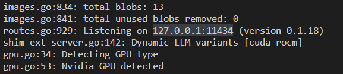
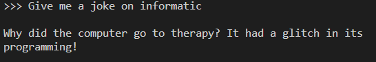

# Ma première IA locale

## Ollama

Pour ce premier exercice nous allons utiliser _ollama_ qui est un moteur de LLM, local. [ollama](https://ollama.ai/)

## Installation

Au choix soit installer localement directement en invite de commande ollama en téléchargeant l'installation ou bien via _docker_

* Sur Mac, suivre le lien de téléchargement

[Téléchargement](https://ollama.ai/download/Ollama-darwin.zip)

Recommendation :  Il est recommandé l'utilisation via docker avec Docker Desktop pour activation de l'accélération du GPU

* Sur Linux ou WSL2

```sh
curl https://ollama.ai/install.sh | sh
```

* Docker

```sh
docker pull ollama/ollama
```

Pour docker attention à installer [NVIDIA Container Toolkit](https://docs.nvidia.com/datacenter/cloud-native/container-toolkit/latest/install-guide.html#installation) si la carte graphique est NVIDIA.

## Lancement du serveur

Une fois installée vous pouvez lancer le serveur ou le conteneur ollama (selon l'installation) qui utilisera le port **11434**

```sh
# lancement avec utilisation des GPU Nvidia
docker run -d --gpus=all -v ollama:/root/.ollama -p 11434:11434 --name ollama ollama/ollama
```

ou

```sh
ollama serve
```

Vous pouvez vérifier la bonne reconnaissance de votre carte graphique en regardant les logs et trouver ce genre d'information



## Ma première intéraction locale

Maintenant que le serveur/conteneur est lancé nous pouvons lui charger un modèle, ici **llama2**. Pour ce faire, nous allons devoir déjà charger le modèle, via l'une des commandes suivantes

```sh
# Docker
docker exec -it ollama ollama run llama2
```

ou

```sh
# local - dans une nouvelle fenêtre
ollama run llama2
```

Cela peut prendre un peu de temps pour télécharger le modèle de plusieurs Mo.

Une fois, la possibilité de renseigner un prompt dans l'invite de commande, réaliser votre première intéraction.
ex :



ou en Français


