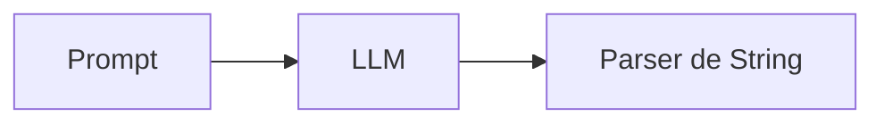
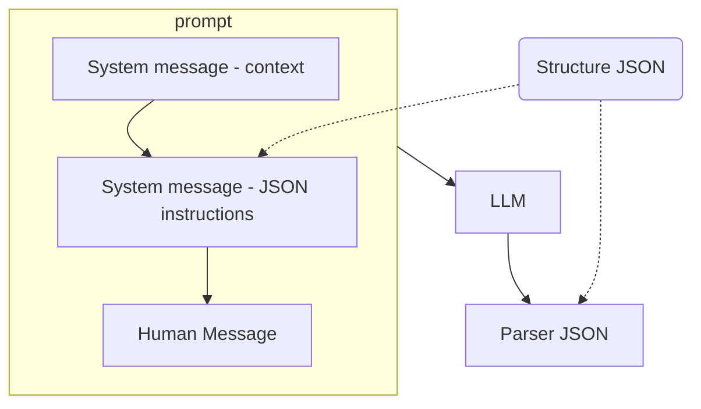

# Langchain - Chain

## Objectif

Pour ce lab, l'idée est de construire et de se familiriaser avec le principe de LCEL et de construire sa première chaîne.



## Etapes

### 1 - Définir un LLM 
Sur la base du précédent lab, définir un LLM relié à un modèle Vertex, par exemple "gemini-1.5-pro".

### 2 - Ajouter un PromptTemplate
Pour structurer le prompt que l'on va transmettre, nous allons utiliser `PromptTemplate` du package **langchain_core.prompts**. Il permet de définir un template pour notre prompt et d'en variabiliser certaines parties en les mettant entre `{}`. La méthode statique `from_template` de `PromptTemplate` permet de créer ce temmplate et injectera les valeurs des champs entre `{}` lors de l'éxécution de la chaîne.

[Documentation du PromptTemplate](https://python.langchain.com/v0.2/docs/concepts/#prompt-templates)

### 3 - Ajouter un OutputParser
Pour embellir la sortie, nous allons utiliser le parser `StrOutputParser` du package *langchain_core.output_parsers**, sans options particulielles.

[Documentation des OutputParser](https://python.langchain.com/v0.2/docs/concepts/#output-parsers)

### 4 - Assembler la chaîne
Le chaînage LCEL se fait via l'operateur `|` entre les objets, que l'on affecte à une variable. On peut ensuite appeler la méthode `invoke` avec les paramètres souhaités, correspondant aux variables définies dans notre template de prompt.

Vous devez arrivé à une écriture proche de celle-ci :

```python
chain = prompt | llm | output_parser
chain.invoke({"input":input})
```


## Aller plus loin

### Streaming
On peut stream la réponse, au lieu d'appeler la méthode `invoke`, utilisez la méthode `stream()`. 
Attention, cette méthode vous retourne un itérateur sur les morceaux de réponses quand ils sont disponibles, donc il va falloir boucler dessus et utiliser la méthode *`print()` avec les options supplémentaires suivantes `end="", flush=True`.

### Batch
Il est aussi possible d'éxecuter une chaîne plusieurs fois de manière consécutive. Pour cela il faudra utiliser la méthode `batch()` qui prend en entrée une liste d'objets avec les paramètres pour chaque itération.
Içi la réponse est retournée sous la forme d'un tableau avec les générations pour chaque éxecution de la chaîne.


### ChatPromptTemplate

On peut trouver des prompts plus avancés tout comme pour les parsers. Essayez avec pour prompt : **ChatPromptTemplate** et pour parser : **JsonOutputParser**. Pour le second s'ajoute une complexité, où il va falloir donner dans le prompt, l'information que l'on souhaite la réponse dans un certain format, pour permettre l'interprétation et la structuration de la réponse correctement.



Pour générer nos prompts à partir de templates nous avons pour le moment utilisé des `PromptTemplate` qui permettent de créer une chaine de caractères avec notre modèle complété par les paramètres de l'utilisateur.

Il existe cependant un autre template auquel il est possible de passer plusieurs messages (pouvant représenter une discussion) en entrée, il s'agit du **`ChatPromptTemplate`**. Il existe plusieurs types de chacun représentant une interaction en particulier dans l'échange :
- `SystemMessage` : permet de fournir des instructions ou du contexte supplémentaire. Il est souvent utilisé pour définir des règles, des objectifs ou des contraintes.
- `AIMessage` : représente un message généré par le LLM. Il contient la plupart du temps la réponse à une entrée de l'utilisateur.
- `HumanMessage` : correspond à un message envoyé précédemment par l'utilisateur.
- `HumanMessagePromptTemplate` : un peu plus complexe qu'un HumanMessage il permet de définir un message envoyé par l'utilisateur en y intégrant un template.

Exemple :
```python
chat_prompt = ChatPromptTemplate.from_messages(
    [
        SystemMessage(content=("You are an helpful assistant.")),
        HumanMessage(content=("Hello !")),
        AIMessage(content=("Hi there! How can I help you today?")),
        HumanMessagePromptTemplate.from_template("{question}")
    ]
)
```

### JsonOutputParser

En plus du `StrOutputParser`, il existe différents autres parsers fournis par LangChain ([liste des parsers](https://python.langchain.com/v0.2/docs/concepts/#output-parsers))

[`Pydantic`](https://docs.pydantic.dev/1.10/)
 est une bibliothèque Python qui facilite la validation de données et qui permet de définir des schémas clairs ainsi que de s'assurer du respect de ces derniers.

Structurez la réponse, en vous basant sur la lib **pydantic**.

_Exemple :_
```python
from langchain_core.pydantic_v1 import BaseModel, Field

class Response(BaseModel):
    answer: str = Field(description="answer to the user's question")
    source: str = Field(description="source used to answer the user's question, should be a website")
```

Les parsers possèdent une méthode `get_format_instructions()` permettant de récupérer le format de l'objet attendu sous forme d'instruction passable au LLM.

Définissez votre parser de sortie JSON en prenant en compte la structure attendue, en utilisant `JsonOutputParser` avec le paramètre `pydantic_object`.

Ensuite, on peut définir notre prompt en tant que `ChatPromptTemplate`. Au sein du prompt ne pas oublier d'ajouter un message de type **"system"**, permettant d'injecter les instructions du format de réponse. Ajouter en dernier message l'input de message qui va nous permettre de prendre en compte l'entrée au moment de l'exécution de la chaîne.

### Etapes
- Définissez le schéma attendu pour la réponse (voir exemple au dessus)
- Instanciez un `JsonOutputParser` avec votre schéma en paramètre (`pydantic_object`)
- Créez un `ChatPromptTemplate` avec en message **system** les instructions sur le format attendu pour la réponse (voir méthode `get_format_instructions()` du parser)
- Ajoutez à ce même `ChatPromptTemplate` un message **human** l'entrée de l'utilisateur (voir exemple avec le `HumanMessagePromptTemplate`).
- Chaînez les éléments (prompt, llm, parser)
- Exécutez la chaîne avec l'entrée de l'utilisateur comme input


Vous devriez arriver à un résultat ressemblant à :
```python
chain = chat_prompt | llm | json_parser
chain.invoke({"question": "What is the capital of Norway?"})

# {'answer': 'Oslo', 'source': 'https://en.wikipedia.org/wiki/Capital_city'}
```
