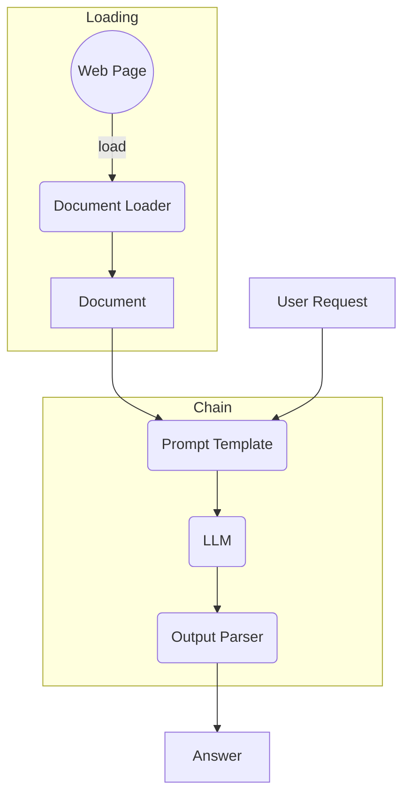

# LangChain - Document Loader

## Objectifs

* Récupérer un document sur lequel on souhaite interrargir avec l'IA
* Construire un template de prompt prenant en compte le contenu du document et la demande de l'utilisateur
* Assembler et exécuter une chaîne à partir de ce prompt



## Etapes

### Préparation du contexte

[Liste des DocumentLoader existants](https://python.langchain.com/v0.2/docs/integrations/document_loaders/)

Avec la classe `WebBaseLoader` du package **langchain_community.document_loaders**, vous allez pouvoir récupérer le contenu d'une page Web à partir de son URL.
La classe se charge d'extraire le contenu textuel de la page en excluant tout élément HTML. Cette action sera effectuée au moment de déclencher la méthode `load()` sur l'objet définit.

Les `DocumentLoader` renvoient toujours une liste de documents. Par exemple, dans le cas d'un fichier PDF, la liste contiendra un document par page du PDF. Ici, pour le `WebBaseLoader`, la liste n'aura qu'un seul document contenant l'ensemble de la page Web récupérée.

[Documentation sur le concept de Document](https://python.langchain.com/v0.2/docs/concepts/#documents)

[Documentation du WebBaseLoader](https://python.langchain.com/v0.2/docs/integrations/document_loaders/web_base/#initialization)

### Prompting

Maintenant que l'on a notre contexte enrichi prêt, il nous faut préparer notre prompt qui va l'utilisé. Pour ce faire, nous utiliserons le template de prompt suivant :

```python
"""Answer the following question based only on the provided context:

<context>
{context}
</context>

Question: {input}"""
```

### Chainage

A partir de ce prompt, nous pouvons maintenat construire une chaîne à laquelle nous allons rajouter un appel à un LLM ainsi qu'un parser de sortie.

Pour le choix du modèle, il nous en faut un compatible avec le template de prompt précédemment créé (au cas où vous souhaitez utiliser un `ChatPromptTemplate`).
Quant au parser un simple `StringOutputParser` sera suffisant.

### Execution

Mainteant, nous pouvons déclencher des exécutions et interroger notre LLM à partir de cette chaîne.

Pour cela il faudra appeler une des méthodes permettant d'intéragir avec une chaîne (comme `invoke()` ou `stream()`) avec les paramètres suivants :

- `<MON_CONTEXTE>`: un contenu enrichissant le contexte de la requête. Cela peut aussi bien être
    - une chaîne de caractères (comme le contenu du `page_content` d'un document)
    - un document (comme le seul document contenu dans la liste après le `load()` d'un `WebBaseLoader`)	
    - une liste de documents (comme celle retournée par les `DocumentLoader`)
- `<MA_REQUETE>`: requête que l'on demande en lien avec le contexte enrichi

```python
document_chain.invoke({
    "input": "<MA_REQUETE>",
    "context": "<MON_CONTEXTE>"
})
```

 La réponse à lire est dans l'attribut `"answer"` de l'objet de retour de la chaîne