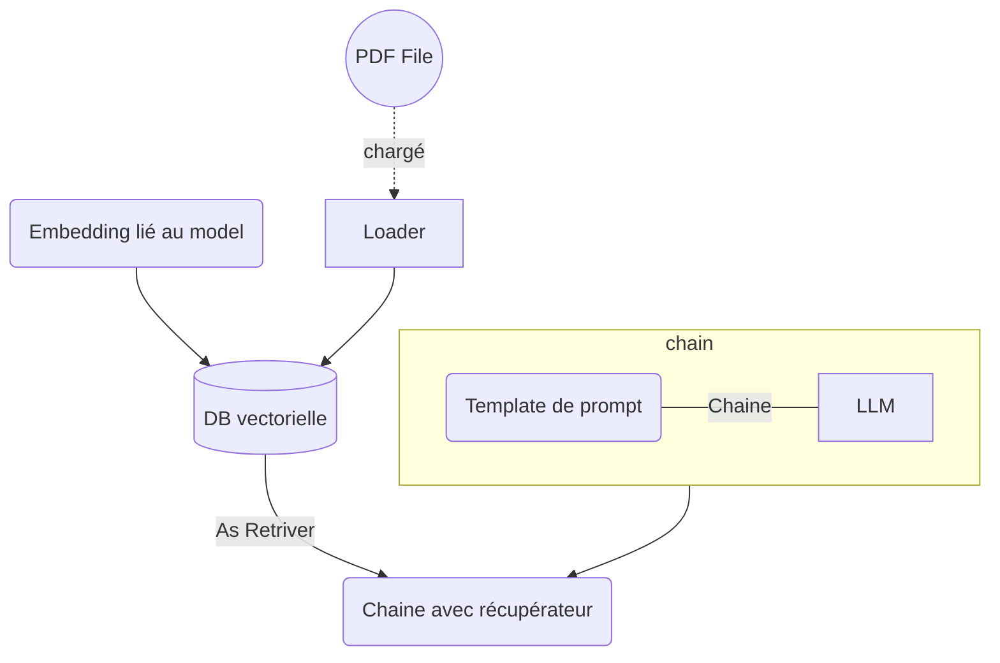
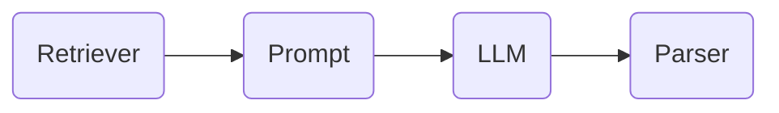

# LangChain - Retrieval

## Objectifs

* Récupérer un document sur lequel on souhaite interrargir avec l'IA
* Indexé ce document
* Interprété ce document comme contexte et interrargir avec l'IA dessus



## Etapes

### Installation des packages

Comme nous allons travailler avec un fichier PDF dans ce Lab il nous faudra installer la libraire `pypdf`.

```sh
pip install pypdf
```

### Préparation du contexte

#### Chargement du document

Cete fois-ci nous allons récupérer le contenu depuis un fichier PDF grâce à la classe `PyPDFLoader` à laquelle il faudra passer le path du chemin vers le fichier à charger. Comme pour le `WebBaseLoader`, il faudra utiliser la méthode `load()` pour charger le document.

[Documentation du `PyPDFLoader`](https://python.langchain.com/v0.2/docs/integrations/document_loaders/pypdfloader/)

#### Découpage du contenu

Une fois le fichier PDF chargé, le `PyPDFLoader` va nous renvoyer une liste de documents chacun contenant le texte d'une page.
Afin de simplifier le travail de contexualisation il faut habituellement prévoir une étape de nettoyage des données.

Ici nous allons simplement découper les documents en plusieurs plus petits afin que chacun contienne moins d'informations et donc un contexte plus simple.

Pour cela nous utiliserons un `RecursiveCharacterTextSplitter` du package **langchain.text_splitter** qui va nous permettre de découper le texte en fonction de 2 paramètres :
- `chunk_size` : la taille maximum d'un document (en nombre de caractères)
- `chunk_overlap` : taille du chevauchement entre deux documents. Ce chevauchement permet de réduire la perde d'information et de contexte lors de la découpe d'un texte

Pour effectuer ce découpage, nous utiliserons la méthode `split_documents()` du `RecursiveCharacterTextSplitter` qui prend en paramètre une liste de documents.

[Documentation de la classe `RecursiveCharacterTextSplitter`](https://python.langchain.com/v0.2/docs/how_to/recursive_text_splitter/)

#### Vectorisation et stockage

Une fois nos documents prêts, il va nous falloir vectoriser leur contenu afin de les stocker dans une base vectorielle.

Pour cela nous allons avoir besoin de :
- un moteur d'embeddings : qui va définir la structure / format des vecteurs et de la base de données principalement en fonction du modèl avec le quel on souhaite travailler.
- un client de base vectorielle : qui va permettre de stocker les documents et leurs embeddings dans une base vectorielle.

Pour l'embedding, nous allons nous servir de `VertexAIEmbeddings` du package **langchain_google_vertexai** qui va nous mettre à disposition un certain nombre de modèles d'embeddings différents (cf : [Liste des modèles](https://cloud.google.com/vertex-ai/generative-ai/docs/embeddings/get-text-embeddings?hl=fr#supported-models)).
Dans notre cas nous allons utiliser le model `textembedding-gecko-multilingual@001` qui a de bons résultats pour la véctorisation de texte multilingues que nous pourrons spécifier avec le paramètre `model_name` du constructeur du ``VertexAIEmbeddings``.

Pour la base vectorielle, nous allons utiliser la librairie fournit par Meta : `FAISS`, qui est disponible dans le package **langchain_community.vectorstores**.
A savoir que FAISS (comme l'ensemble des Vector Store) possède une méthode statique `from_documents()`. Elle s'utilise en passant en paramètres :
- les documents à vectoriser / stocker
- la structure / format de l'embedding

[Documentation du Vector Store `FAISS`](https://python.langchain.com/v0.2/docs/integrations/vectorstores/faiss/)

### Prompting

Maintenant que l'on a notre contexte enrichi prêt, il nous faut préparer notre prompting qui va l'interpréter. Pour ce faire, nous allons utiliser un des prompts mis à disposition sur [**LangChain Hub**](https://smith.langchain.com/hub). Il s'agit d'un dépôt communautaire où il est possible de trouver des templates de prompt, des agents, des chaînes ou d'autres outils utilisables directement dans LangChain.

Par exemple nous pouvons y trouver ce [prompt](https://smith.langchain.com/hub/rlm/rag-prompt?organizationId=a187f7c0-ea6c-562e-87f4-605000629bb1) qui ressemble à :

```
HUMAN

You are an assistant for question-answering tasks. Use the following pieces of retrieved context to answer the question. If you don't know the answer, just say that you don't know. Use three sentences maximum and keep the answer concise.

Question: {input} 

Context: {context} 

Answer:
```

Dans notre cas, recréez le prompt correspondant à l'exemple ci-dessus.

### Execution

#### Chaînage

LangChain founit deux méthodes globales qui vont nous être utiles pour la création de la chaîne :
- `create_stuff_documents_chain()` du package **langchain.chains.combine_documents** : qui permet de construire une chaîne permettant de transmettre des documents à un LLM à partir du LLM cible ainsi que du prompt associé
- `create_retrieval_chain()` du package **langchain.chains.retrieval** : qui permet de construire une chaîne permettant de récupérer des documents à partir d'un **Retriever** et d'une chaîne de transmission de documents

[Documentation de la méthode `create_stuff_documents_chain()`](https://python.langchain.com/v0.2/api_reference/langchain/chains/langchain.chains.combine_documents.stuff.create_stuff_documents_chain.html)

[Documentation de la méthode `create_retrieval_chain()`](https://python.langchain.com/v0.2/api_reference/langchain/chains/langchain.chains.retrieval.create_retrieval_chain.html)

#### Appel

Notre chaîne maintenant construite il nous est possible de l'appeler :

```python
answer = chain({"input": "<MA_REQUETE>"})
```

 La réponse à lire est dans l'attribut `"answer"` de l'objet de retour de la chaîne

## Aller plus loin

Au lieu d'utiliser les méthodes `create_stuff_documents_chain()` et `create_retrieval_chain()`, nous pouvons aussi créer notre prompt ainsi que notre chaîne manuellement.

Notre chaîne devrait ressembler à :


Afin de pouvoir passer notre requête à la partie **Prompt** de la chaîne, nous allons devoir utiliser un `RunnablePassthrough()`. Ce composant permet de transmettre une des entrées d'une chaîne directement à l'étape suivante.
Dans ce cadre la première étape de la chaîne serait :

```python
{"context": retriever, "input": RunnablePassthrough()}
```

De plus lors de l'utilisation d'un `RunnablePassthrough()`, il n'est pas nécessaire de transmettre notre requête avec un format JSON mais on peut simplement faire :

```python
chain.invoke("<MA_REQUETE>")
```

[Documentation pour le RunnablePassthrough](https://python.langchain.com/v0.2/docs/how_to/passthrough/)

Complétez la chaîne en y ajoutant :
- un `ChatPromptTemplate`
- un appel au LLM
- un `JsonOutputParser` avec un format définit par un objet `pydantic`
