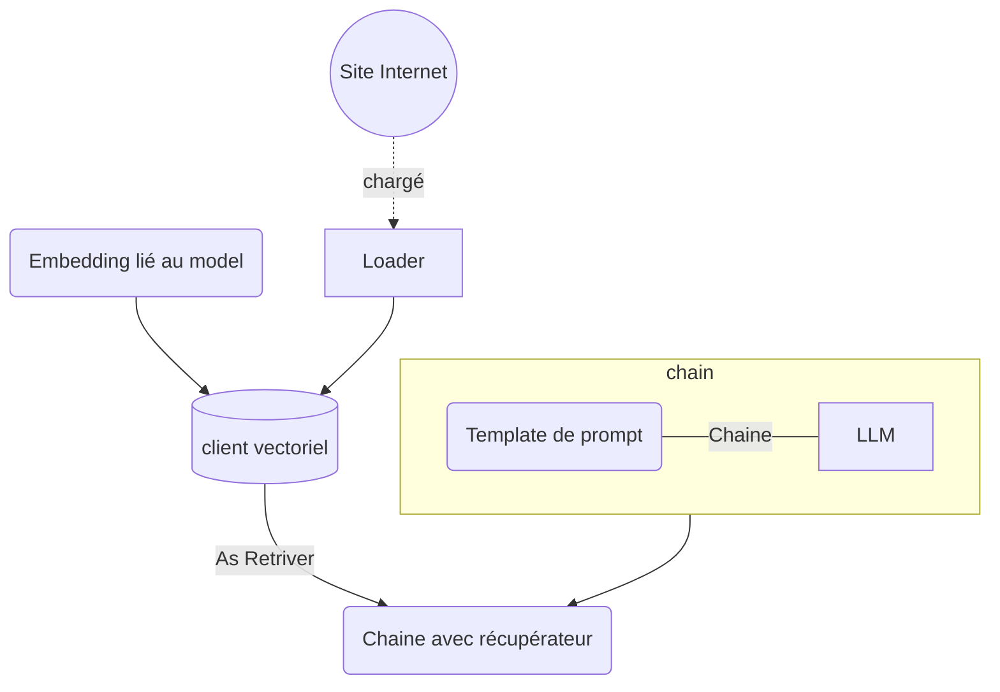

# LangChain - Retrieval

## Objectifs

* Récupérer un document sur lequel on souhaite interrargir avec l'IA
* Indexé ce document
* Interprété ce document comme contexte et interrargir avec l'IA dessus

## Etapes

Avec la classe **WebBaseLoader** de `langchain_community.document_loaders`, vous allez pouvoir récupérer le contenu d'un site WEB.
La classe se charge d'extraire le contenu text de la page en excluant tout élément HTML. Cette action sra effectuée au moment de déclencher la méthode `load()` sur l'objet définit.

Pour indexer le document, il va nous falloir plusieurs éléments :
* un "embedding" qui va définir la structure/format de la base vectorielle en fonction principalement du model ciblé avec lequel on souhaite travailler
* un client de base vectorielle, le constructeur et l'emplacement de stockage des données

Pour l'embedding, vous allez utiliser **OllamaEmbedding** du package `langchain_community.embeddings` qui va nous permettre au travers de ses paramètres de ciblé le bon modèle cible d'IA.
