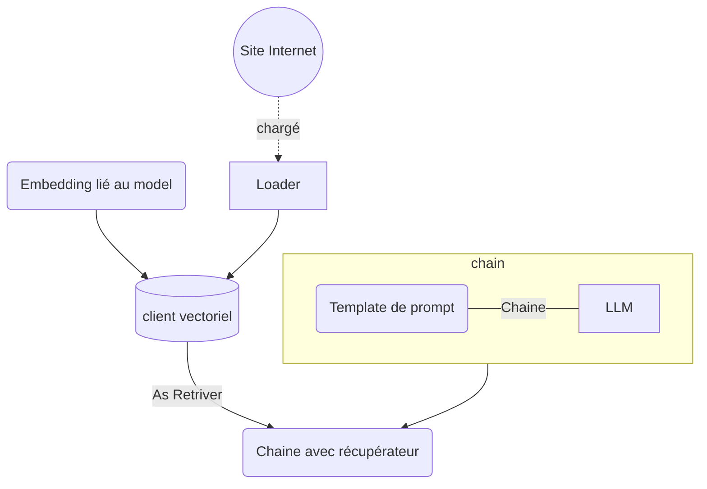

# LangChain - Retrieval

## Objectifs

* Récupérer un document sur lequel on souhaite interrargir avec l'IA
* Indexé ce document
* Interprété ce document comme contexte et interrargir avec l'IA dessus



## Etapes

### Préparation du contexte

Avec la classe **WebBaseLoader** du package `langchain_community.document_loaders`, vous allez pouvoir récupérer le contenu d'un site WEB.
La classe se charge d'extraire le contenu text de la page en excluant tout élément HTML. Cette action sera effectuée au moment de déclencher la méthode *`load()`* sur l'objet définit.

Pour indexer le document, il va nous falloir plusieurs éléments :

* un interpréteur du texte, ici on va surtout utiliser un splitter pour découper le contenu. Mais il faut comprendre, qu'il faut prévoir une étape de nettoyage du fichier. Cela simplifie le travail de contextualisation pour questionner notre IA ensuite
* un client de base vectorielle, le constructeur et l'emplacement de stockage des données
* un "embedding" qui va définir la structure/format de la base vectorielle en fonction principalement du model ciblé avec lequel on souhaite travailler

Pour l'interprétateur, on va utiliser le splitter de texte : **RecursiveCharacterTextSplitter** du package `langchain.text_splitter`

Pour la structure vectorielle, nous allons utiliser la librairie fournit par Meta : **FAISS**, qui est disponible dasn le package `langchain_community.vectorstores`.
A savoir que FAISS a une méthode statique *`from_documents()`* que l'on va utiliser directement avec en input nos documents une fois traités ET notre cible de format d'embedding.

Pour l'embedding, vous allez utiliser **OllamaEmbeddings** du package `langchain_community.embeddings` qui va nous permettre au travers de ses paramètres de ciblé le bon modèle cible d'IA.

Ici, avec ces éléments, vous pouvez déjà générer les vecteurs de représentation votre document.

### Prompting

Maintenant que l'on a notre contexte enrichi prêt, il nous faut préparer notre prompting qui va l'interpréter. Pour ce faire, utiliser le template de prompt suivant :

```python
"""Answer the following question based only on the provided context:

<context>
{context}
</context>

Question: {input}"""
```

Langchain fournit une méthode globale *`create_stuff_documents_chain()`* (du package `langchain.chains.combine_documents `) pour construire votre chaîne pour document dédié avec votre llm cible et votre prompt comme entrée.

### Execution

Mainteant, nous pouvons déclencher des exécutions et interroger notre llm avec ces éléments complémentaires.

En première exécution, afin de mieux les prochaines commandes, il est demandé de déclencher la commande suivante, où :

* `<MA_REQUETE>`: requête que l'on demande en lien avec le contexte enrichi
* `<MON_CONTEXTE>`: un contenu d'une courte description d'un contexte que l'on souhaite ajouter et interroger dessus.

```python
document_chain.invoke({
    "input": "<MA_REQUETE>",
    "context": [Document(page_content="<MON_CONTEXTE>")]
})
```

Normalement la réponse ne sera que peu pertinente, car nous avons pas injecté notre contexte vectoriel précédemment construit. 
Pour ce faire, votre vecteur construit possède une méthode de transformation *`as_restriever()`* dont l'objet obtenu est à transmettre à la méthode global *`create_retrieval_chain()`* du package `langchain.chains.retrieval`, avec votre chain pour document.
Refaites votre requête sur cette nouvelle chaîne. Celle-ci devrait-être beaucoup plus pertinente. 

(La réponse à lire est dans l'attribut `"answer"` de l'objet de retour de la chaîne)
