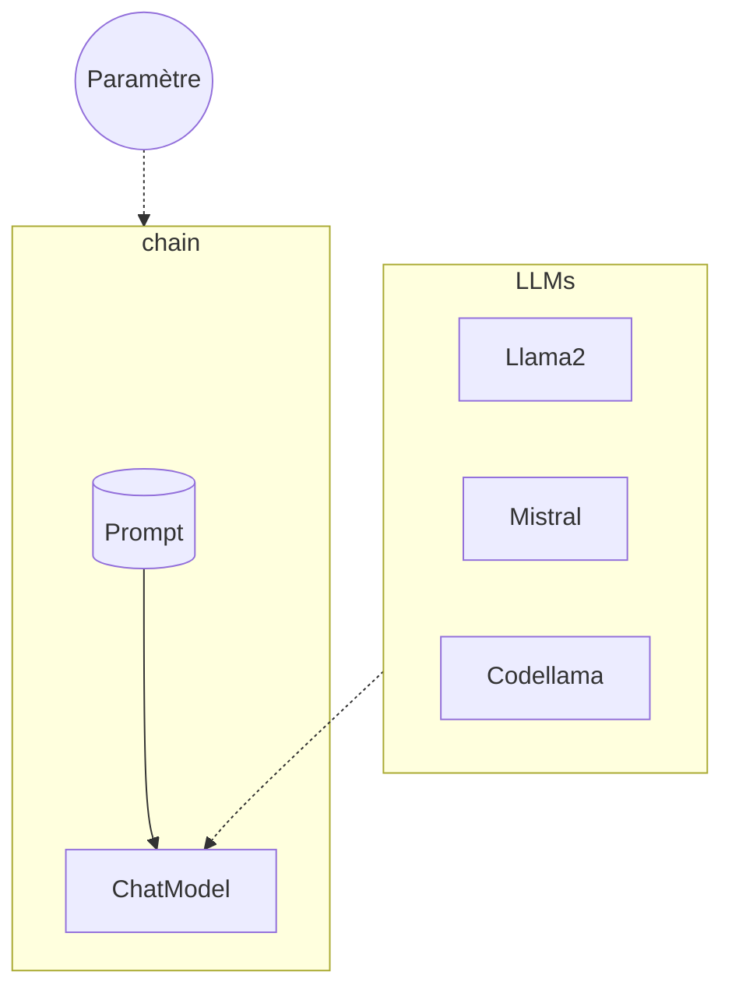

# LangChain - callbacks et configurables

## Objectifs

S'interconnecter avec plusieurs modèles de LLMs.



## Etapes

### Gestion des callbacks

Afin d'identifier les LLMs utilisés, nous allons voir une première approche avec les callbacks afin de log une métadonnée d'information.
Pour ce faire, il faut définir une class, ex: `MyHandler` qui hérite de `BaseCallbackHandler` du package **langchain.callbacks.base**.

Ensuite dans la classe il suffit de définir les méthodes que l'on souhaite surcharger, parmis les suivantes :

* def on_llm_start
* def on_llm_end
* def on_llm_error
* def on_chain_start
* def on_chain_end

Une fois la classe construite, on peut utiliser celle-ci avec le paramètre `callbacks` du constructeur de nos Modèle de Language qui prend en charge une liste de `BaseCallbackHandler`.
Concernant les metadonnées que l'on souhaite ajouter (comme le nom du modèle), il est possible de le faire à partir d'un dictionnaire avec le paramètre `metadata` de ce même constructeur.

En repartant du Lab 03, construire une liste de trois chaînes avec des callbacks personnalisés pour les modèles `gemini-1.5-pro`, `text-bison`, `text-unicorn` (ce dernier ayant des quotas particuliers il est utilisé afin de trigger le `on_llm_error`). Il ne faudra pas oublier d'ajouter en métadonné le nom du modèle lors de la création des `VertexAI` ou `ChatVertexAI`.
Puis faire exécuter les trois chaînes, et vérifier les logs.

[Documentation sur les callbacks](https://python.langchain.com/v0.2/docs/concepts/#callbacks)

### Champs configurables

Il peut arriver que se présente le besoin de personnaliser certaines parties du LLM. Pour cela il est possible définir certains paramètres comme étant configurables grâce à la méthode `configurable_fields()`. Elle permet de spécifier une valeur pour ce paramètre lors d'une exécution données.

```python
model = ChatOpenAI(temperature=0).configurable_fields(
    temperature=ConfigurableField(
        id="llm_temperature",
        name="LLM Temperature",
        description="The temperature of the LLM",
    )
)

# Exécution avec la valeur par défaut
model.invoke("pick a random number")

# Exécution avec la valeur personnalisée
model.with_config(configurable={"llm_temperature": 0.9}).invoke("pick a random number")
```

[Documentation des champs configurables](https://python.langchain.com/v0.2/docs/how_to/configure/#configurable-fields)

### Configurations alternatives

Il est aussi possible grâce à la méthode `configurable_alternatives()`, pour un paramètre donné, de proposer une liste de valeurs possibles correspondant chacune à une configuration différente.
Cette méthode requiert plusieurs propriétés :

* `ConfigurableField` : permettant de définir quelle propriété va servir d'alternatives : 
```python
ConfigurableField(id="nom_du_parametre")
```
* `default_key` : la valeur par défaut utilisée pour la configuration

Ensuite dans la méthode tous les arguments sous la forme ```Key=Value``` complémentaires vont définir les différentes alternatives de la ressource.

[Documentation des configurations alternatives](https://python.langchain.com/v0.2/docs/how_to/configure/#configurable-alternatives)

### Plusieurs modèles de language en 1

Définissez un ChatModel ou LLMModel compatible pour plusieurs types (ex: reprendre `gemini-1.5-pro`, `gemini-1.0-pro` et `text-bison`).

Afin d'identifier les modèles lors de leur réponse, ajouter en premier message, un message système forçant le fait que l'IA doit s'identifier clairement avant toute réponse à la requête.
