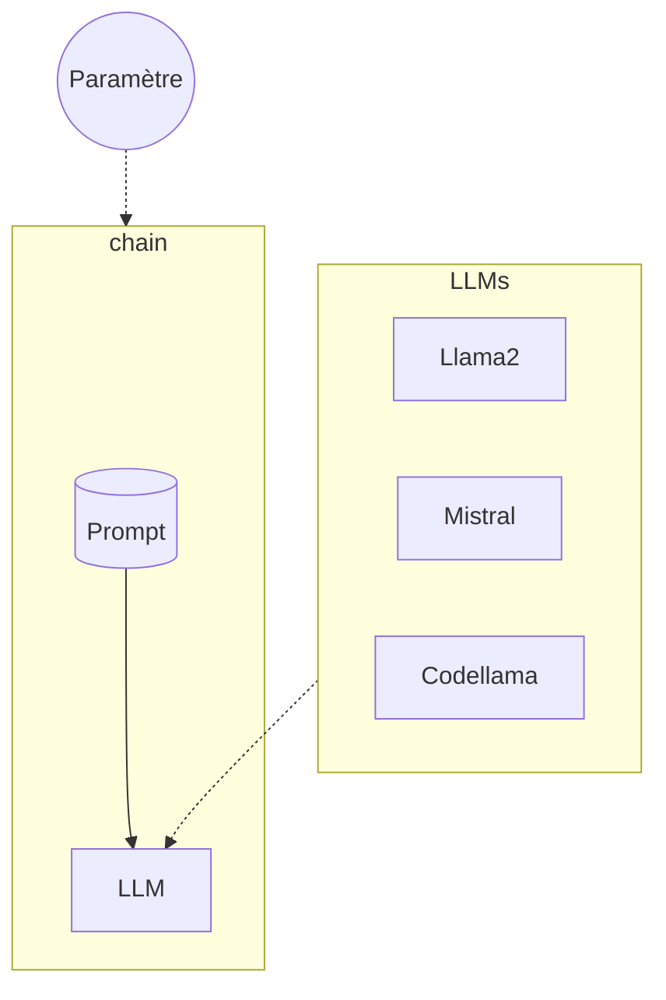

# LangChain - LLMs

## Objectifs

S'interconnecter avec plusieurs LLMs.



## Etapes

### Liste de chaînes

Afin d'identifier les LLMs utilisés, nous allons voir une première approche avec les callbacks afin de log une métadonnée d'information.
Pour ce faire, il faut définir une class, ex: `MyHandler` qui hérite de l'interface `BaseCallbackHandler` du package `langchain.callbacks.base`.

Ensuite dans la classe il suffit de définir les méthodes que l'on souhaite surcharger, parmis les suivantes :

* def on_llm_start
* def on_llm_end
* def on_llm_error
* def on_chain_start
* def on_chain_end

Une fois la classe construite, on peut utiliser celle-ci avec la propriété **callbacks** de définition de nos Modèle de Language.

Maintenant, en repartant du lab 03, construire une liste de trois chaînes d'intégration pour les modèles LLama2, Mistral et 3ème au choix.
Puis faire exécuter les trois chaînes, et vérifier les logs.

**Avancé :** Adapter et réaliser une exécution asynchrone des trois chaînes.

### 3 Modèles de language en 1

Une autre écriture est possible en utilisant la méthode *`configurable_alternatives()`* directement sur le constructeur du modèle.
Cette méthode requiert plusieurs propriétés :

* ConfigurableField : permettant de définir quelle propriété va servir d'alternatives, ici on utilisera **id**
* default_key : le nom de la clé par défault utilisée

Et ensuite dans la méthode tous les arguments sous la forme ```Key=Value``` complémentaires vont définir les différentes alternatives de la ressource.

Définissez un ChatModel, compatible pour trois types (ex: llama2, mistral, codellama).

Afin d'identifier les modèles lors de leur réponse, ajouter en premier message, un message système forçant le fait que l'IA doit s'identifier clairement avant toute réponse à la requête.
