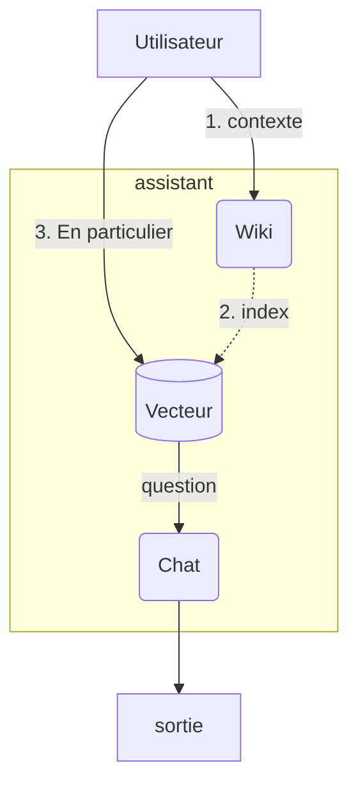

# LangChain - Assistant

## Objectifs

* Créer un assistant d'interrogation sur Wikipedia

## Etapes

 Dans l'exercice, il vous est recommandé de définir des fonctions pour les différentes sections pour faciliter la lecture et la compréhension en cas d'accompagnement sur l'exercice.

### Outil Wikipedia

Utiliser l'outil Wikipedia fourit par langchain, qui est un wrapper de la librairie python **wikipedia**.
Vous allez pouvoir trouver **WikipediaQueryRun** dans le package *ttols* et **WikipediaAPIWrapper** sera disponible dans le package *langchain_community.utilities*.

* WikipediaQueryRun va être l'interface
* WikipediaAPIWrapper est un paramètre de WikipediaQueryRun, qui contient la config du client Wikipedia

Le client wikipedia répondra sous d'une chaîne de caractère où  le double retour chariot `\n\n` sert de séparation entre les pages identifiées. Le nombre de page retournée est paramétrable.

### base vectorielle

Envoyer le contenu d'une page wikipedia, dans une base vectorielle, pour lpouvoir enrichir le model.
Pour cela vous allez avoir besoin :

* embedding `OllamaEmbeddings` - correspondant au bon model d'interprétation
* d'un client de base vectorielle, recommandation `Chroma`, qui va vous permettre de vectoriser via la méthode `from_texts` les documents issues de la(des) page(s) Wikipedia récupéré, selon le bon format d'embedding.
* La récupération du contexte spécifique pourra se faire directement sur l'index via la méthode `similarity_search`

### Chain

Définir la base du prompting avec un chat local, ex: mistra.
Préparer une liste de message avec un premier message "Système" pour amener un contexte d'exécution pour l'IA et recommendation de réponse. Y ajouter également le contexte enrichi issue de la demande de l'utilisateur et transmettre la requête de l'utilisateur.

Et au final exécuter cette chaine construite.
