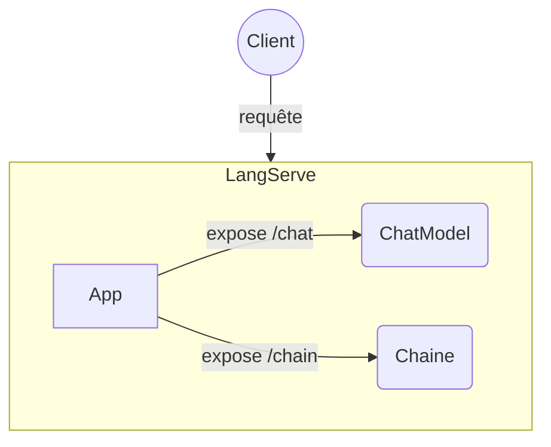

# LangChain - LangServe

## Objectifs

* Créer deux composants LangChain : un ChatModel et une chaîne
* Construire la partie Backend d'exposition
* Définir un client de test de notre exposition

## Etapes

### LangServe

Installer les packages `langserve` et `langchain-cli` puis utiliser la commande `langchain app new school-app` afin de créer une nouvelle application.
Dans le répertoire `school-app/app/` se trouve un fichier python `server.py`, qui va permettre d'exécuter notre serveur LangServe.

### ChatModel et Chain

A partir des labs précédents construire :
- un `ChatModel` (ex: gemini-1.5-pro)
- une chaîne : avec un prompt, un appel à un LLM et un parser de sortie

Dans le fichier `server.py` ajouter les routes pour les `ChatModel` et `chain` via la méthode `add_routes`.
Cette méthode prend 3 paramètres qui sont dans l'ordre :
- l'application FastAPI à laquelle la route doit être ajoutée (une variable `app` est déjà créée dans `server.py` lors de l'initialisation du projet)
- le composant à exposer (notre chaine ou notre ChatModel)
- `path=/xxx` la route sur laquelle sera exposé le composant

### Client

#### Proposition de client python :
Définir un client python `RemoteRunnable` du package **langserve**, (par exemple dans un notebook dédié). Ce dernier prend en paramètre de constructeur l'URL du serveur LangServe avec la route du composant à utiliser.

Une fois créer, ce `RemoteRunnable` s'utilise de la même manière que le composant exposé. C'est à dire par exemple que s'il s'agit d'une chaîne, il sera possible de l'utiliser comme une chaîne avec la méthode `invoke()`.

Il faudra donc créer 2 instances de `RemoteRunnable`, un pour notre chaîne et un pour notre `ChatModel`. Il sera ensuite possible d'intéragir avec.

A partir de celui correspondant à notre `ChatModel`, il faudra créer une chaine avec un prompt et un parser et l'exécuter. 
Idem pour celui correspondant à notre chaîne, il faudra exécuter cette dernière en passant les bons paramètres.

#### Appels en direct :
Les composants LangChain étant exposés via API par LangServe, ils sont aussi directement utilisables par un appel HTTP.
Faire un appel avec un `curl` ou avec une solution comme [Postman](https://www.postman.com/) ou [Insomnia](https://insomnia.rest/) sur les routes exposées.

[Documentation pour la partie client de LangServe](https://python.langchain.com/v0.2/docs/langserve/#client)